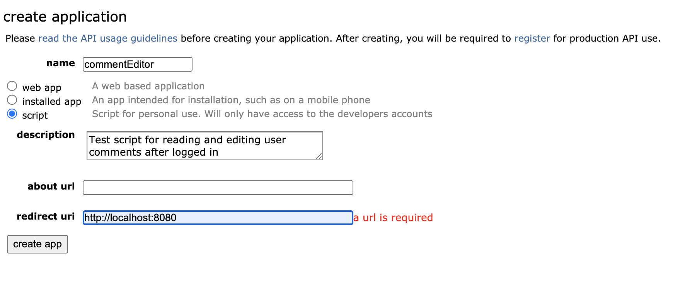
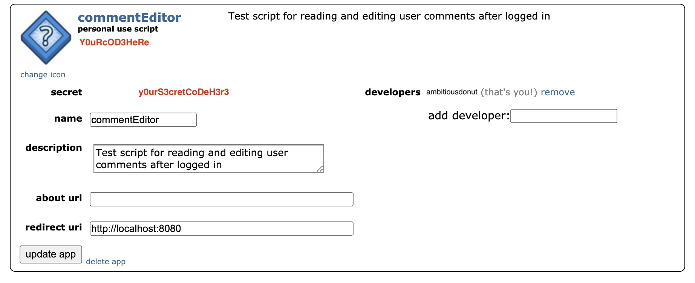
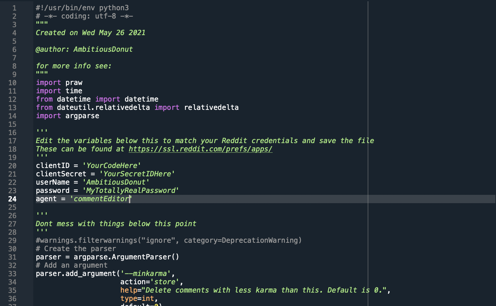

# redditEraser
Python script to delete old comments by age and/or karma amount.  


# Instructions
## Getting Access Tokens from Reddit
In order to access you comment history, you first need to allow access to you account.Go to [https://www.reddit.com/prefs/apps](https://www.reddit.com/prefs/apps) and click 'create another app'. 

  

Pick a name (whatever you want) and select 'script'. The redirect URL is not needed for this, but is a required field. Feel free to just enter the localhost address. Then click 'create app'. 



Now you have the tokens needed to login and run the script. Copy then name you gave the script with Reddit, your ClientID (shown as YourCodeHere in the image above) and ClientSecret (YourSecretCodeHere). These will only work for logging in to the specific account that created them, so if you have multiple accounts you will need to repeat this step for each one. 

## Dependencies
This script uses the Python library [PRAW](https://praw.readthedocs.io/en/latest/)
as well as python-dateutil

to install PRAW use either
```
conda install -c conda-forge praw
```
or  
```
pip install praw
```
depending on how you manage Python environments. The pip version is usually more up-to-date. 

## Running the Script


Download and open the script in a text editor.  
Towards the top, change the clientID, clientSecret, userName, password, agent  
'agent' is the name you gave the script when you created you access tokens with Reddit. 
Save and close the file. 

Open Terminal (MacOS) or command line (Windows) and navigate to where the script is saved.  
There are two options for deleting comments: age, minkarma
```
python redditEraser.py --help
>usage: redditEraser.py [-h] [--minkarma MINKARMA] [--age AGE]
>
>optional arguments:
>  -h, --help           show this help message and exit
>  --minkarma MINKARMA  Delete comments with less karma than this. Default is 0.
>  --age AGE            Delete comments older than this (in days). Default is 7 days.
```
By default, everything older than 7 days and below 0 karma will be deleted. When running the script, it will ask you to confirm your settings before proceeding. 

For example, to delete anything below 100 karma and older than 90 days:  
```
python redditEraser.py --minkarma 100  --age 90
```

```
> Total karma for AmbitiousDonut: 147689
>  
> Deleting comments older than 80 days and below 5 karma
> Procede? y/n 
> y
> ...0 comments processed...
> ...100 comments processed...
> ...200 comments processed...
> ...300 comments processed...
> ...400 comments processed...
> ...500 comments processed...

> 572 comments processed
> 61 comments deleted
```

PRAW can access a maximum of 1000 comments at a time. If you have a lot of comments, you might have to run the script more than once. If you reach the limit in a run, it will display:
```
PRAW limit of 1000 comments per instance reached
```

---

Found this guide helpful? Tips are always appreciated.  
Bitcoin (BTC): bc1qjyd9cyvykljh4jeurk60cje0g4nqp0sd3dvy9q or QR code  
or via Crypto_TheBot on Telegram @AmbitiousDonut  
